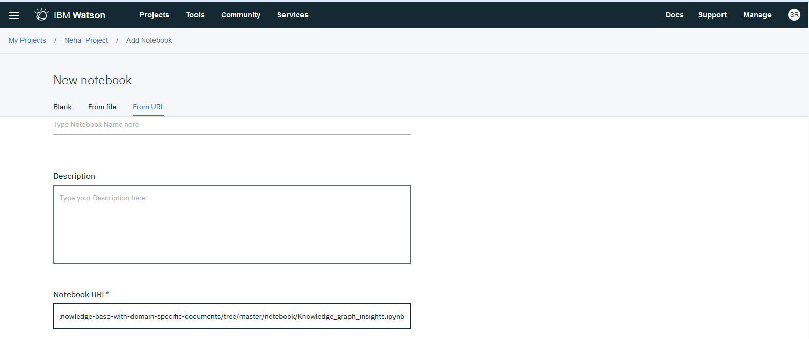

# Travel-Process-Management

## Included components

* [IBM Watson Studio](https://www.ibm.com/cloud/watson-studio): Analyze data using RStudio, Jupyter, and Python in a configured, collaborative environment that includes IBM value-adds, such as managed Spark.

* [IBM Cloud Object Storage](https://console.bluemix.net/catalog/infrastructure/cloud-object-storage): An IBM Cloud service that provides an unstructured cloud data store to build and deliver cost effective apps and services with high reliability and fast speed to market.

* [Watson Natural Language Understanding](https://console.bluemix.net/catalog/services/natural-language-understanding/?cm_sp=dw-bluemix-_-code-_-devcenter): A IBM Cloud service that can analyze text to extract meta-data from content such as concepts, entities, keywords, categories, sentiment, emotion, relations, semantic roles, using natural language understanding.

## Featured technologies

* [Jupyter Notebooks](http://jupyter.org/): An open-source web application that allows you to create and share documents that contain live code, equations, visualizations and explanatory text.
* [Data Science]()
* [Path Traversal]()

# Steps

Follow these steps to setup and run this code pattern. The steps are
described in detail below.

1. [Sign up for Watson Studio](#1-sign-up-for-watson-studio)
1. [Create IBM Cloud services](#2-create-ibm-cloud-services)
1. [Create the notebook](#3-create-the-notebook)
1. [Add the data and configuraton file](#4-add-the-data-and-configuration-file)
1. [Update the notebook with service credentials](#5-update-the-notebook-with-service-credentials)
1. [Run the notebook](#6-run-the-notebook)
1. [Download the results](#7-download-the-results)
1. [Analyze the results](#8-analyze-the-results)

## 1. Sign up for Watson Studio

Sign up for IBM's [Watson Studio](https://dataplatform.ibm.com). By creating a project in Watson Studio a free tier ``Object Storage`` service will be created in your IBM Cloud account. Take note of your service names as you will need to select them in the following steps.

> Note: When creating your Object Storage service, select the ``Free`` storage type in order to avoid having to pay an upgrade fee.

## 2. Create the notebook

* In [Watson Studio](https://dataplatform.ibm.com), click on `Create notebook` to create a notebook.
* Create a project if necessary, provisioning an object storage service if required.
* In the `Assets` tab, select the `Create notebook` option.
* Select the `From URL` tab.
* Enter a name for the notebook.
* Optionally, enter a description for the notebook.
* Enter this Notebook URL: https://github.com/IBM/watson-document-classifier/blob/master/notebooks/watson_document_classifier.ipynb
* Select the free Anaconda runtime.
* Click the `Create` button.

## 3. Add the data and configuration file

#### Add the data and configuration to the notebook

* From the `My Projects > Default` page, Use `Find and Add Data` (look for the `10/01` icon)
and its `Files` tab.
* Click `browse` and navigate to this repo `watson-document-classifier/data/sample_text.txt`
* Click `browse` and navigate to this repo `watson-document-classifier/configuration/sample_config.txt`

> Note:  It is possible to use your own data and configuration files.
If you use a configuration file from your computer, make sure to conform to the JSON structure given in `configuration/sample_config.txt`.

#### Fix-up file names for your own data and configuration files

If you use your own data and configuration files, you will need to update the variables that refer to the data and configuration files in the Jupyter Notebook.

In the notebook, update the global variables in the cell following `2.3 Global Variables` section.

Replace the `sampleTextFileName` with the name of your data file and `sampleConfigFileName` with your configuration file name.

## 4. Update the notebook with service credentials

* Select the cell below `2.2 Add your service credentials for Object Storage` section in the notebook to update the credentials for Object Store.
* Delete the contents of the cell
* Use `Find and Add Data` (look for the `10/01` icon) and its `Files` tab. You should see the file names uploaded earlier. Make sure your active cell is the empty one below `2.2 Add...`
* Select `Insert to code` (below your sample_text.txt).
* Click `Insert Crendentials` from drop down menu.
* Make sure the credentials are saved as `credentials_1`.

